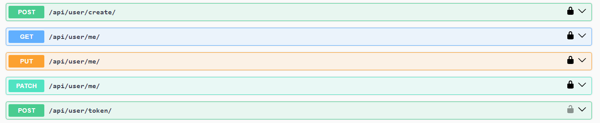
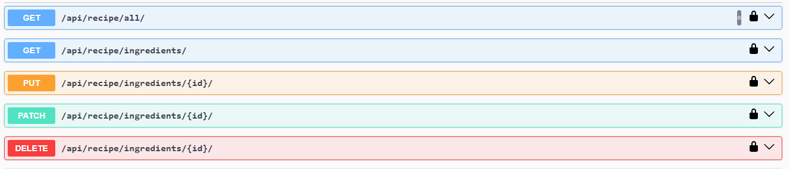
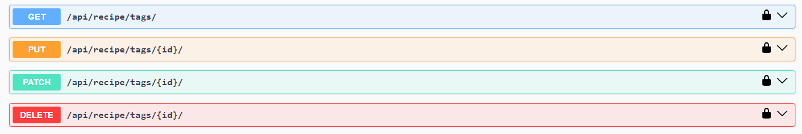
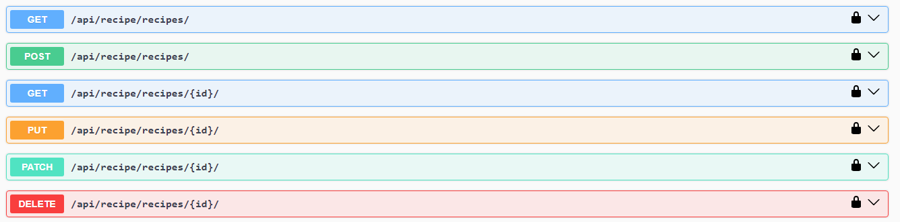

# recipe-api-app Django and Django REST Framework project for Racipe Instruction Application

# Screen Shots

# API Documentation using drf-spectacular

- APIs for User Management, Authenticaion

- APIs for Ingredients

- APIs for Tags

- API's For Recipe ManageMent

- APIs for Image Upload

